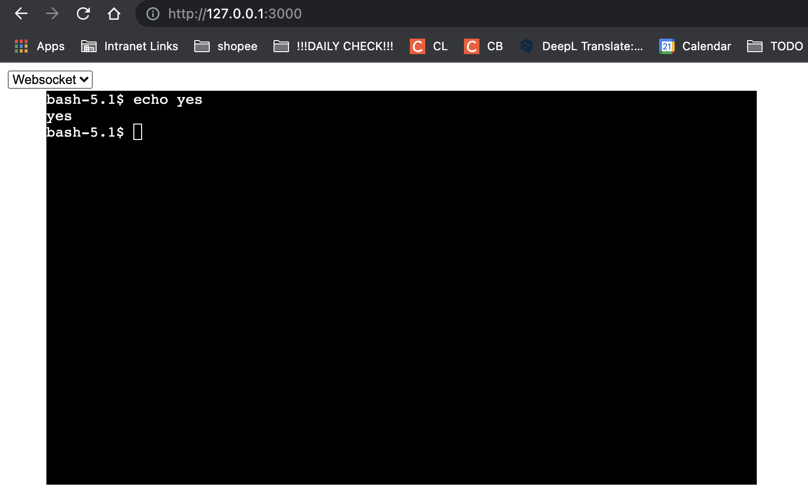

# Introduction
A web-based terminal. The UI is based on [xterm.js](https://github.com/xtermjs/xterm.js). 

All commands are sent to backend's `bash` process, and the result is sent back, supported by [microsoft/node-pty](https://github.com/microsoft/node-pty).

Browser uses websocket to communicate with server.The server uses [express](https://github.com/expressjs/express) and [ws](https://github.com/websockets/ws).

# Qucikstart
```bash
# install necessary dependencies
npm install

# build the client 
npm run build

# start the serve
# accessible from http://127.0.0.1:3000
npm run start
```

# Output
